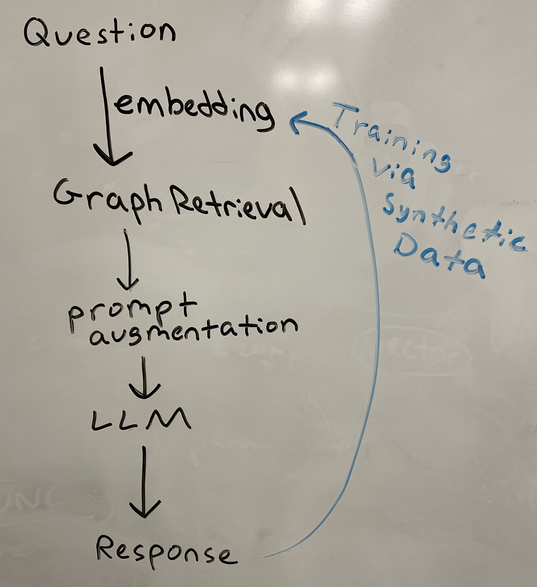
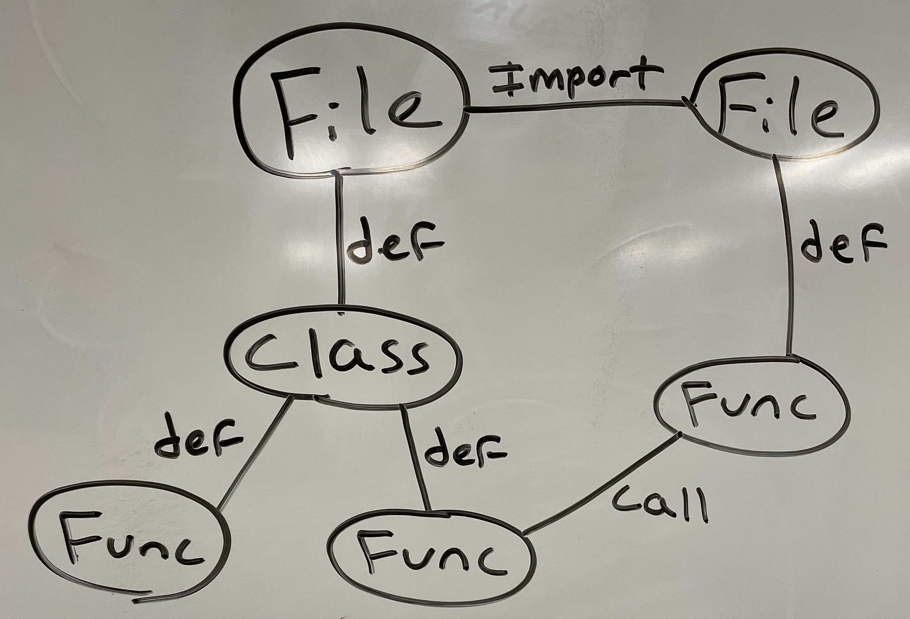

# Napkin 
A fast, lightweight graph retrieval-augmented generation tool for navigating codebases. 

## 💡 Inspiration
As developers, we are always exploring new projects and open-source repositories. However, the complexity and scale of these codebases serve as a major barrier to entry even for the most experienced developers. Even after spending countless hours reading over files, documentations, and (hopefully solved) issues, it's easy to find yourself lost and intimidated. We wanted to create a tool that would help developers navigate these codebases more effectively, answering questions and providing context on both specific and broad aspects of the codebase.

Modern large language models struggle with hallucinations, lack of specificity, and lack of context. We hope to address these shortcomings by using a knowledge graph to provide context and information to the model, allowing it to better understand the codebase and answer questions more effectively.

## 🙌 What it does
Napkin is a graph retrieval-augmented generation tool that converts a codebase into a knowledge graph containing detailed relationships between all files, functions, and classes. This knowledge graph is then used to answer questions about the codebase, automatically providing relevant context and information to queries made by the user to a fine-tuned LLM.

The basic workflow of Napkin is as follows:

The process begins when a user asks a question about a codebase. The question then is embedded into a vector using a pre-trained model. The vector is then used to query the knowledge graph, which returns a set of nodes that represent the files, functions, and classes that are most relevant to the question. The nodes are then used to augment the original prompt and generate a response to the question using a fine-tuned language model. The response is then returned to the user, providing them with the information they need to understand the codebase better.

## 👷 How we built it
As shown in the prior section, Napkin has a few key moving parts:
1. Custom built python knowledge graph parser
2. LLM fine tuning via Hugging Face
3. Fine-tuned embedding model
4. Graph retrieval algorithm
5. Prompt augmentation engine

We built Napkin's knowledge graph parser using Python to best fit our specific needs. Our parser is built with the help of `ast`, a powerful module that allows for the parsing of python code into an abstract syntax tree (AST). We used this library to parse each file in the codebase into an AST, and then iterated through the AST to identify the relationships between files, classes, and functions. We then used this information to construct a graph, with nodes representing files, classes, and functions, and edges representing the relationships between them, such as imports, definitions, and calls.

An example of the graph structure can be seen here:

We fine-tuned a [Llama 7B model](https://huggingface.co/meta-llama/Llama-2-7b) from Hugging Face to better understand codebase questions and provide more relevant answers. We chose this model because ____

We also fine-tuned an embedding model to better represent the relationships between nodes in the knowledge graph. We used the [CodeBERT](https://github.com/microsoft/CodeBERT) model to generate embeddings for each node in the graph, and then fine-tuned the model to better represent the relationships between nodes.

We implemented a custom graph retrieval algorithm that uses the embeddings generated by the embedding model to find the most relevant nodes in the knowledge graph to a given query. We used a greedy heuristic search that maximized cosine similarity at each step to find the most relevant nodes, and then returned the set of nodes that were most relevant to the query. This means that we started with the node that was most similar to the query, and then iteratively added the most similar nodes to the set of nodes until we filled our context.

Finally, we implemented a prompt augmentation engine that used the set of nodes returned by the graph retrieval algorithm to augment the original prompt and generate a response to the query using the fine-tuned LLM.

## 🛑 Challenges we ran into
We began our project hoping to implement one of two preexisting models for knowledge graph generation from python repositories. The first was Google research's [python-graphs](https://github.com/google-research/python-graphs), which excels at creating in-depth control flow graphs and program graphs from functions in python. However, we quickly realized that this model was not well-suited for our purposes, as it was designed primarily for functions and single files at largest, and would not be able to handle the scale of a full codebase. Our model relies on a thorough understanding of the entire codebase and the relationships between distinct files, functions, and classes, which python-graphs was not designed to handle. The next model we attempted to use was IBM Wala's [graph4code](https://github.com/wala/graph4code), which builds upon models such as python-graphs by explicitly modeling library calls, following data flow across functions, and simulating function calls. Despite its appeal, the model was not as well-documented and we spent many hours attempting to implement it towards the beginning of the hackathon only to choose another route.

Instead, we came to a decision as a group to build our own knowledge graph creation tool from scratch to analyze classes and functions in python, along with the way that they interact with each other. We used the `ast` library to parse the python code of each file into an abstract syntax tree (AST), a data structure used to represent the structure of code written in a formal language. We then iterated through each file, paying close attention to any import statements that represented relationships beteween files. We also kept track of the parent/child relationships between all classes and functions. Next, we identified all function calls and class instantiations to further populate the relationships within our graph.

Each file, function, and class was then represented as a node in the graph, with edges between them representing the relationships we had identified. Every node contains the type of node, the name of the node, the file/class/function it is directly within, the classes/functions it is a child of, the classes/functions it calls or defines, and any other relevant metadata. 

Upon constructing the graph by recursively traversing the AST of every file in the repository, we then discovered that we needed to perform a significant amount of cleaning. Nodes which used small amounts of extra data, such as small functions with no children, did not provide enough value to warrant keeping in the graph, as their parent function/class/file would already contain all of the relevant information. We also needed to remove any nodes such that the raw text they contained was too large for the model to reasonably handle. This process of parsing, pruning, and later serializing our graph took a significant amount of time and effort we hoped to have spent implementing a preexisting model. 

Another challenge we faced was

## 😁 Accomplishments that we're proud of
We're proud of 

## 🧑‍🎓 What we learned

## 🔮 What's next for Napkin
There are four main ways for Napkin to enhance and fine tune its performance:
1. The knowledge graph
2. Chatbot fine tuning
3. Graph retrieval fine tuning
4. Embedding fine tuning

Firstly, the knowledge graph could be improved by increasing the capacity for nodes and edges, particularly for more categories than just files, classes, and functions. 

Secondly, the chatbot could be fine-tuned to better understand how to answer codebase questions and provide more relevant information. This would require some prompt engineering to best present the information to the chatbot, as well as extra model training with a larger dataset of codebase questions and answers.

The graph retrieval algorithm we implemented was based on a greedy heuristic search that maximized cosine similarity at each step, which was just one of many options. For example, we discussed pursuing Monte Carlo Tree Search as our main algorithm and adding weighted edges depending on the type of relationship between components to encourage the model to traverse the graph in a more meaningful way. 

Finally, the embeddings used to represent the nodes in the graph could be fine-tuned to better represent the relationships between nodes. This would require a more sophisticated model to be used to generate the embeddings, as well as a more sophisticated method of training the model to best represent the relationships between nodes.

Furthermore, we would love to see Napkin expanded to other languages such as Java, C, Golang, and Rust, as well as to a broad types of codebases such as web applications, mobile applications, and more. The potential for Napkin to be used as a tool for developers to navigate and understand codebases is immense, and we are excited to see where it goes from here.